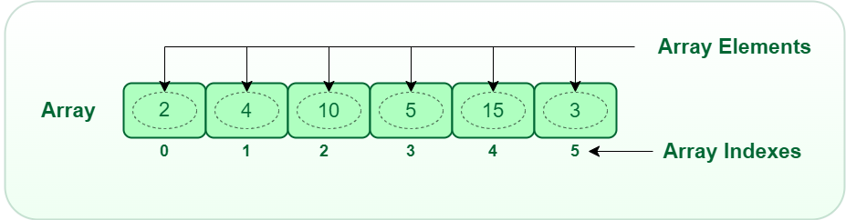

# Algorithms and Data Structures

**[[Source](https://github.com/trekhleb/javascript-algorithms)]**
**[[Source 2](https://github.com/loiane/javascript-datastructures-algorithms)]**
**[[Source 3](https://www.bigocheatsheet.com/)]**

## Big O Notation

Big O notation is used to classify algorithms according to how their running time or space requirements grow as the input size grows. On the chart below you may find most common orders of growth of algorithms specified in Big O notation.

## Data Structures

A data structure is a particular way of organizing and storing data in a computer so that it can be accessed and modified efficiently. More precisely, a data structure is a collection of data values, the relationships among them, and the functions or operations that can be applied to the data.

### Array

An `array` is a linear data structure that collects elements of the same data type and stores them in contiguous and adjacent memory locations. Arrays work on an index system starting from 0 to (n-1), where n is the size of the array.

### Stack

In computer science, a stack is an abstract data type that serves as a collection of elements, with two principal operations:

push, which adds an element to the collection, and
pop, which removes the most recently added element that was not yet removed.
The order in which elements come off a stack gives rise to its alternative name, LIFO (last in, first out). Additionally, a peek operation may give access to the top without modifying the stack. The name "stack" for this type of structure comes from the analogy to a set of physical items stacked on top of each other, which makes it easy to take an item off the top of the stack, while getting to an item deeper in the stack may require taking off multiple other items first.

Simple representation of a stack runtime with push and pop operations.

### Queue

In computer science, a queue is a particular kind of abstract data type or collection in which the entities in the collection are kept in order and the principle (or only) operations on the collection are the addition of entities to the rear terminal position, known as enqueue, and removal of entities from the front terminal position, known as dequeue. This makes the queue a First-In-First-Out (FIFO) data structure. In a FIFO data structure, the first element added to the queue will be the first one to be removed. This is equivalent to the requirement that once a new element is added, all elements that were added before have to be removed before the new element can be removed. Often a peek or front operation is also entered, returning the value of the front element without dequeuing it. A queue is an example of a linear data structure, or more abstractly a sequential collection.

Representation of a FIFO (first in, first out) queue

### Singly-Linked List

In computer science, a linked list is a linear collection of data elements, in which linear order is not given by their physical placement in memory. Instead, each element points to the next. It is a data structure consisting of a group of nodes which together represent a sequence. Under the simplest form, each node is composed of data and a reference (in other words, a link) to the next node in the sequence. This structure allows for efficient insertion or removal of elements from any position in the sequence during iteration. More complex variants add additional links, allowing efficient insertion or removal from arbitrary element references. A drawback of linked lists is that access time is linear (and difficult to pipeline). Faster access, such as random access, is not feasible. Arrays have better cache locality as compared to linked lists.

### Doubly Linked List

In computer science, a doubly linked list is a linked data structure that consists of a set of sequentially linked records called nodes. Each node contains two fields, called links, that are references to the previous and to the next node in the sequence of nodes. The beginning and ending nodes' previous and next links, respectively, point to some kind of terminator, typically a sentinel node or null, to facilitate the traversal of the list. If there is only one sentinel node, then the list is circularly linked via the sentinel node. It can be conceptualized as two singly linked lists formed from the same data items, but in opposite sequential orders.

The two node links allow traversal of the list in either direction. While adding or removing a node in a doubly linked list requires changing more links than the same operations on a singly linked list, the operations are simpler and potentially more efficient (for nodes other than first nodes) because there is no need to keep track of the previous node during traversal or no need to traverse the list to find the previous node, so that its link can be modified.

### Hash Table

In computing, a hash table (hash map) is a data structure which implements an associative array abstract data type, a structure that can map keys to values. A hash table uses a hash function to compute an index into an array of buckets or slots, from which the desired value can be found

Ideally, the hash function will assign each key to a unique bucket, but most hash table designs employ an imperfect hash function, which might cause hash collisions where the hash function generates the same index for more than one key. Such collisions must be accommodated in some way.

Hash collision resolved by separate chaining.

### Heap - max and min heap versions

In computer science, a heap is a specialized tree-based data structure that satisfies the heap property described below.

In a min heap, if P is a parent node of C, then the key (the value) of P is less than or equal to the key of C.

### Tree

In computer science, a tree is a widely used abstract data type (ADT) — or data structure implementing this ADT—that simulates a hierarchical tree structure, with a root value and subtrees of children with a parent node, represented as a set of linked nodes.

A tree data structure can be defined recursively (locally) as a collection of nodes (starting at a root node), where each node is a data structure consisting of a value, together with a list of references to nodes (the "children"), with the constraints that no reference is duplicated, and none points to the root.

A simple unordered tree; in this diagram, the node labeled 7 has two children, labeled 2 and 6, and one parent, labeled 2. The root node, at the top, has no parent.

### Binary Search Tree

In computer science, binary search trees (BST), sometimes called ordered or sorted binary trees, are a particular type of container: data structures that store "items" (such as numbers, names etc.) in memory. They allow fast lookup, addition and removal of items, and can be used to implement either dynamic sets of items, or lookup tables that allow finding an item by its key (e.g., finding the phone number of a person by name).

Binary search trees keep their keys in sorted order, so that lookup and other operations can use the principle of binary search: when looking for a key in a tree (or a place to insert a new key), they traverse the tree from root to leaf, making comparisons to keys stored in the nodes of the tree and deciding, on the basis of the comparison, to continue searching in the left or right subtrees. On average, this means that each comparison allows the operations to skip about half of the tree, so that each lookup, insertion or deletion takes time proportional to the logarithm of the number of items stored in the tree. This is much better than the linear time required to find items by key in an (unsorted) array, but slower than the corresponding operations on hash tables.

A binary search tree of size 9 and depth 3, with 8 at the root. The leaves are not drawn.

### Graph (both directed and undirected)

In computer science, a graph is an abstract data type that is meant to implement the undirected graph and directed graph concepts from mathematics, specifically the field of graph theory

A graph data structure consists of a finite (and possibly mutable) set of vertices or nodes or points, together with a set of unordered pairs of these vertices for an undirected graph or a set of ordered pairs for a directed graph. These pairs are known as edges, arcs, or lines for an undirected graph and as arrows, directed edges, directed arcs, or directed lines for a directed graph. The vertices may be part of the graph structure, or may be external entities represented by integer indices or references.

## Algorithms

An algorithm is an unambiguous specification of how to solve a class of problems. It is a set of rules that precisely define a sequence of operations
